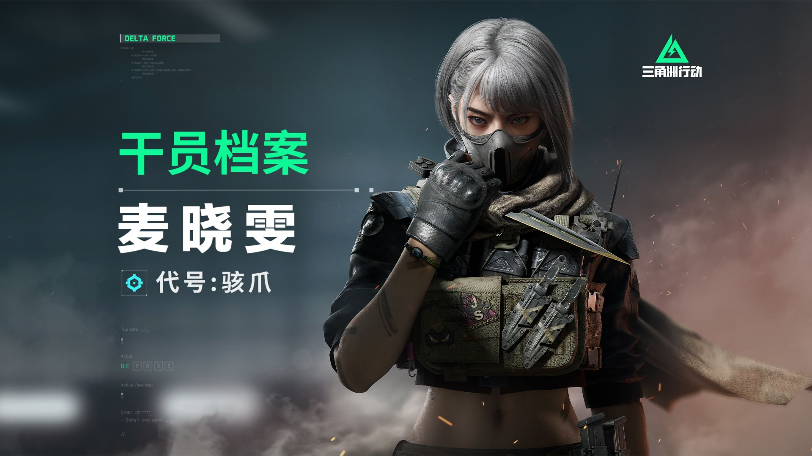
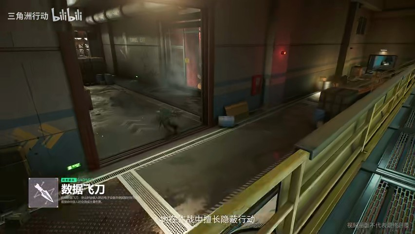

# Cosplay Production Kit 🎭

**角色 Cosplay 全流程企划工作台**：角色拆解 → 三视图收集 → 还原方案 → 拍摄企划 → 执行落地。

一个可复用的 Cosplay 企划方法论模板，套用于任意角色（不绑定个人装备/预算）。

## 📦 仓库结构

```
cosplay-production/
├── skill/
│   └── SKILL.md              # 完整企划方法论（7 大模块）
└── examples/
    └── 麦晓雯_企划/           # 实战示例：三角洲行动「骇爪」麦晓雯
        ├── 麦晓雯_企划.md     # 完整企划文档（含嵌入参考图）
        ├── 官方美图_*.png/jpg # 官方立绘/海报（游侠网）
        ├── 官方档案帧_*.jpg   # B站官方干员档案视频抽帧（含背面视角）
        └── B站_*封面.jpg      # B站视频封面（档案/Cos正片/装备简介）
```

## 🎯 企划方法论（SKILL.md 七模块）

1. **角色档案** — 出处/性格/气质/标志性元素/名场面
2. **设定图与三视图收集** — 官方设定图 + 三视图（正/侧/背）+ 细节特写
3. **造型解构** — 发型/妆容/服装/道具逐项拆解
4. **还原方案** — 从解构到可执行采购/制作步骤
5. **拍摄企划** — 场景/光线/镜头动作/后期
6. **执行清单** — 从档案到出片的完整 checklist
7. **参考资源** — 立绘/Cos正片来源索引

## 🛠️ 核心技巧：B站视频抽帧收集三视图

游戏官方宣传视频/干员档案视频通常包含**多角度角色展示**（正/侧/背），比静态图更全：

```
B站搜索 API（国内直连） → 找官方档案视频 → 获取播放地址
→ 下载视频 → PyAV 按时间戳抽帧 → vision 验证 → 归档
```

- **B站必须国内直连**（设置代理会触发 412 风控）
- PyAV（`pip install av`）比 ffmpeg 更稳（macOS 上 ffmpeg 常缺 x265 动态库）

## 📸 实战示例：麦晓雯（三角洲行动·骇爪）







### 示例收集成果

| 来源 | 数量 | 内容 |
|------|------|------|
| 游侠网官方美图 | 11 | 官方立绘/海报/全身图 |
| B站官方档案视频抽帧 | 12 | 角色多角度展示，含背面视角 + 道具特写 |
| B站视频封面 | 6 | 官方档案/Cos正片/装备简介/模型素材 |

视角覆盖：**正面 ✅ / 背面 ✅ / 侧面 ⚠️待补**
道具参考：**信号破译器 ✅**（第一人称画面）

## 🚀 使用方式

每出新角色，按 SKILL.md 模板走一遍：

1. 选定角色 → 填写角色档案
2. 收集三视图（官方立绘 + B站视频抽帧 + 小红书正片）
3. 造型解构 → 还原方案
4. 拍摄企划 → 执行清单 → 出片

完整企划文档示例见 [`examples/麦晓雯_企划/麦晓雯_企划.md`](examples/麦晓雯_企划/麦晓雯_企划.md)

---

*企划方法论 · 随用随更新 · 每个实战角色都会回填新技巧*
