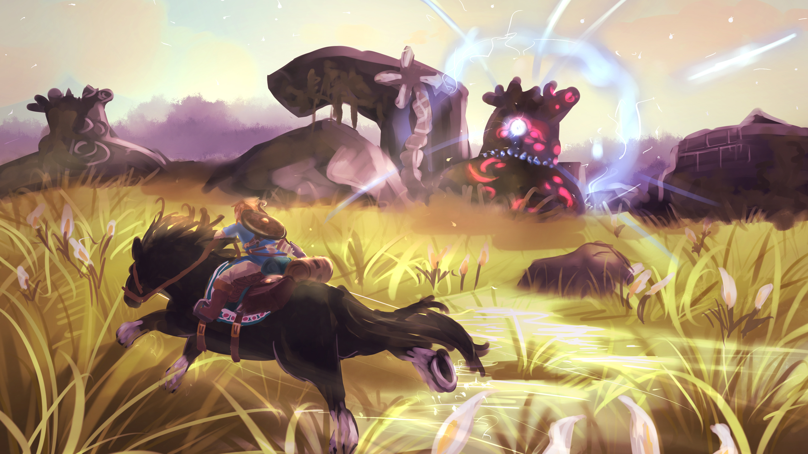
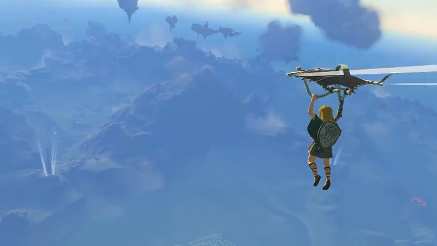
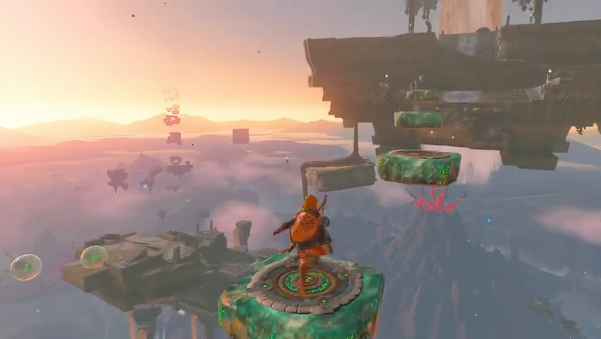
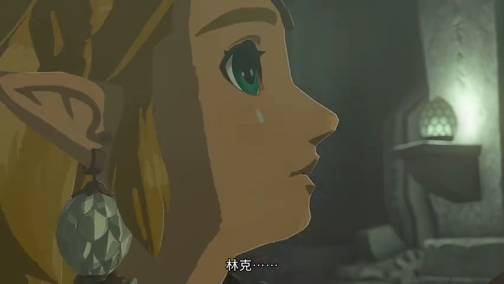
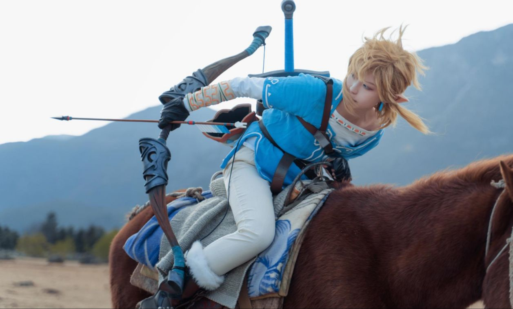
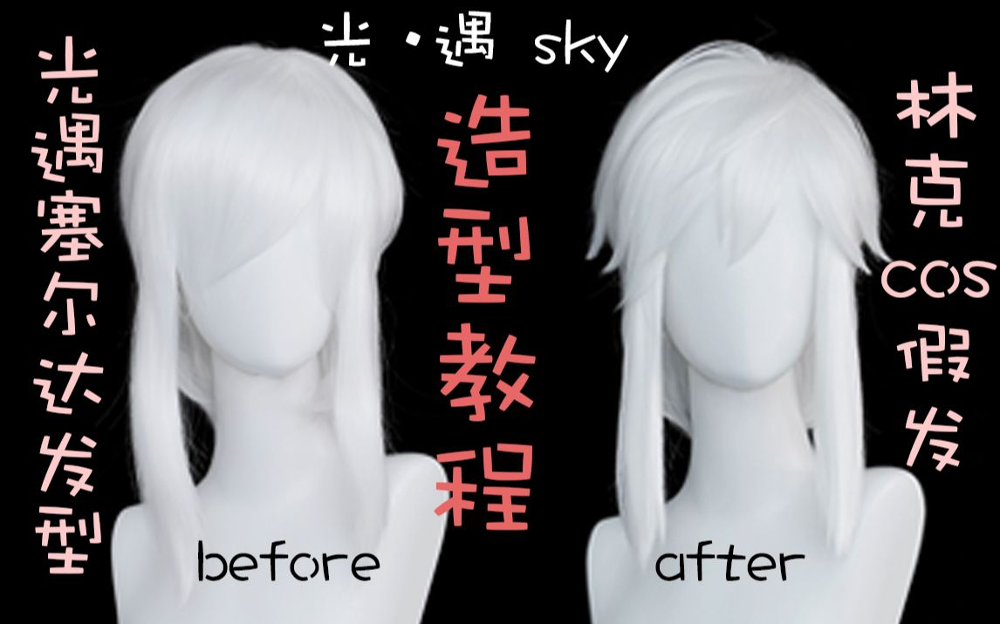

# 林克（Link）Cosplay 企划书

> 生成时间：2026-08-01
> 模板：cosplay-production（角色Cosplay企划工作台）
> 状态：企划草案（三视图收集进行中）

---

## 1. 角色档案（Character Dossier）

```
- 出处：《塞尔达传说》系列（任天堂，1986至今）
- 身份：海拉鲁王国的勇者，大师剑的持有者
- 性格关键词：勇敢、沉默寡言、坚韧、正义
- 气质定位：少年英雄 / 沉默的剑士
- 标志性元素：金发束发、蓝色英杰服、大师剑、海利亚盾
- 名场面/经典动作：拔大师剑、滑翔翼飞行、骑马奔驰、林克时间
- 版本差异：旷野之息（蓝衣短发）/ 王国之泪（英杰服束发+新手臂）/ 时之笛（绿帽绿衣）等
```

---

## 2. 设定图与三视图收集（Reference Collection）

> ✅ **已收集 19 个文件**（2026-08-01），按版本分轨存于 `~/Desktop/林克_企划/`

| 目录 | 数量 | 内容 |
|------|------|------|
| 旷野之息/ | 11 | 3DM 官方壁纸图集（含骑马全身、侧面视角） |
| 王国之泪/ | 4 | IGN 最终预告抽帧（侧面全身/背面全身/特写） |
| 通用/ | 4 | B站 cos 正片/画师教程/假发教程封面 |

**三视图状态**：
- **旷野之息**：正面 ⚠️（官方壁纸多为场景/侧面） / 侧面 ✅ / 背面 ⚠️
- **王国之泪**：正面 ⚠️ / 侧面 ✅（滑翔翼全身+特写） / 背面 ✅（橙斗篷全身）
- **待补**：正面全身立绘（优先）、英杰服细节特写、大师剑/海利亚盾道具特写

### 2.0 关键参考图（嵌入）

**旷野之息 · 骑马全身（经典形象）：**



**王国之泪 · 侧面全身（滑翔翼）：**



**王国之泪 · 背面全身（橙斗篷）：**



**王国之泪 · 金发特写：**



**B站 cos 正片封面（旷野之息）：**



**假发造型教程封面：**



### 2.1 收集优先级

1. **官方设定图**：任天堂官网 / Zelda Wiki（需代理）/ 3DM 图集
2. **三视图**：IGN 官方预告抽帧 + Pixiv 画师设定稿
3. **细节特写**：英杰服结构、束发带系法、大师剑纹样、海利亚盾图案
4. **优秀Cos正片**：B站/小红书真人还原效果

### 2.2 主要收集平台与搜索词

| 平台 | 搜索词 | 用途 |
|------|--------|------|
| **Bilibili** | 林克 cos / 王国之泪 预告 / 林克 三视图 | 视频抽帧+正片 |
| **Pixiv** | リンク 三面図 / 設定資料 | 画师设定稿（需代理） |
| **小红书** | 林克 cos / 塞尔达 cos 服装 | 真人正片、道具测评 |
| 3DM/游侠 | 塞尔达 壁纸 图集 | 官方壁纸批量下载 |
| 淘宝 | 林克 cos服 / 大师剑 道具 | 服装版型验证 |

### 2.3 版本区分（三视图/造型按版本分轨）

| 版本 | 特征 | 造型复杂度 | 三视图状态 |
|------|------|-----------|-----------|
| **旷野之息** | 金发束发+蓝衣+大师剑 | 经典基础款 | 侧面✅ 正/背待补 |
| **王国之泪** | 英杰服+新机械手臂+束发 | 细节较多（机械臂） | 侧/背✅ 正面待补 |
| 时之笛/黄昏公主 | 绿帽绿衣 | 复古经典 | 未收集 |

**皮肤/版本选择**：由企划者根据偏好、预算和还原难度自行决定。

### 2.4 归档规范

- 统一存 `~/Desktop/林克_企划/`
- 按版本分子目录（旷野之息/王国之泪/通用）
- 关键参考图嵌入 MD 文档（自包含可分享）

---

## 3. 造型解构（Costume Deconstruction）

### 3.1 发型（Hair）

| 项 | 特征（旷野之息/王国之泪） | 还原方案 |
|----|--------------------------|---------|
| 发色 | 金色/亚麻金 | 金色假发 |
| 长度 | 中长发（过肩，束发） | 中长金发假发 |
| 发式 | **束发**（王国之泪是低束发+碎发） | 假发扎低马尾/束发髻 |
| 标志性细节 | 束发带/发绳、额前碎发 | 蓝色发带（英杰服配套） |

**要点**：金色假发要注意发色自然度（避免太黄太假），束发位置参考官方图；旷野之息版是披肩发+束发带。

### 3.2 妆容（Makeup）

| 部位 | 方案 |
|------|------|
| 眼型基调 | 剑士的坚毅眼神（眼尾轻微上挑） |
| 眼线 | 黑色眼线，轻微拉长眼型 |
| 眉形 | 自然粗眉（英气） |
| 唇色 | 裸色/自然色（不抢眼） |
| 妆面风格 | **清透自然**（林克是少年感，不是浓妆） |

### 3.3 服装（Costume）——以旷野之息经典款为例

| 项 | 特征 | 还原方案 |
|----|------|---------|
| 主色系 | 蓝色（英杰服）+ 棕色下装 | 蓝上衣+棕裤 |
| 英杰服 | 蓝色束腰短上衣+白色内衬 | 淘宝cos服 |
| 腰带 | 棕色皮带+搭扣 | 配套 |
| 靴子 | 棕色长靴 | 配套 |
| 配饰 | 蓝色束发带、耳环（王国之泪有） | 配套 |

### 3.4 道具（Props）——灵魂道具

| 道具 | 特征 | 方案 |
|------|------|------|
| **大师剑** | 银刃+蓝柄+金色剑格 | 淘宝道具（¥50-150） |
| **海利亚盾** | 蓝色盾面+红色纹章 | 淘宝道具 |
| 弓/箭袋 | 旷野之息标配 | 可选 |
| 滑翔翼（王国之泪） | 红色滑翔翼 | 可选，出片加分 |

---

## 4. 还原方案（Reproduction Plan）

### 4.1 采购清单（旷野之息基础款）

> 预算依据：photography-planning.md 知识库「预算分配法则」（材料40%/工具30%/道具20%/余量10%）

| 项 | 方案 | 预算 |
|----|------|------|
| 金色中长发假发 | 淘宝「林克 假发」**选高温丝/卡丝**（造型保持好，漫展首选） | ¥80-150 |
| 英杰服cos服全套 | 淘宝「林克 cos服」（含裤靴腰带） | ¥150-300 |
| 大师剑+海利亚盾 | 淘宝道具 或 **自制**（见下方制作方案） | ¥100-200 |
| 蓝色发带 | 配套 | ¥10-20 |
| **合计** | | **¥340-670** |

### 4.2 道具自制方案（知识库 techniques.md + materials-tools.md）

**大师剑（自制，预算 ¥80-150）：**

| 部件 | 材料（来自知识库） | 制作要点 |
|------|------------------|---------|
| 剑刃 | **EVA 泡沫 10mm**（大型结构件，¥55-85/张） | 热风枪塑形+斜切出刃角 |
| 剑柄核心 | **PVC 管**（道具核心结构首选） | 内部框架 |
| 剑格/细节 | **泡沫黏土**（Lumin's Workshop，可打磨）或 **Apoxie Sculpt**（环氧补土） | 塑形+补缝 |
| 金属质感 | **Rub 'n Buff 金属蜡**（¥55/管） | 手指涂抹，让泡沫像真金属 |
| 旧化 | 丙烯颜料兑稀洗液 | 渗入缝隙做磨损 |

**海利亚盾（自制）：**

| 部件 | 材料 | 制作要点 |
|------|------|---------|
| 盾面 | **EVA 泡沫 10mm** 或 **Sintra/PVC板**（平面硬板更佳，¥85-210） | 平面盾面用 Sintra 保持挺括 |
| 盾面纹章 | **工艺泡沫 2mm** 细节层 或 **树脂打印** | 叠层做浮雕感 |
| 密封 | **FlexBond** 3-4层薄涂（泡沫上色前必须） | 层间轻砂，密封差=上色差 |

### 4.3 服装面料升级（知识库 materials-tools.md）

- **英杰服主体**：弹力氨纶/莱卡（贴合身形，¥55-105/码）——比普通棉布更显身材线条
- **内衬**：纯棉平纹布（透气好缝，¥28-55/码）
- **腰带/护腕**：仿皮/人造革（裁剪干净不脱线，¥70-140/码，**用夹子不用针**）
- **缝制**：先做试衣版（便宜布）改合身度，再裁真布

### 4.4 执行步骤

1. 正面全身立绘收集（补三视图缺口）
2. 假发+服装+道具下单（假发选高温丝）
3. 束发造型练习（发带系法）
4. 妆面（清透自然）试妆
5. 试光（自然光/暖调）
6. 正式拍摄

---

## 5. 拍摄企划（Shoot Plan）

### 5.1 场景（Location）

| 方案 | 场景 | 适合 |
|------|------|------|
| A | 户外草地/森林（海拉鲁氛围） | 旷野之息 |
| B | 山顶/崖边（滑翔翼视角） | 王国之泪 |
| C | 室内棚拍+绿幕（后期合成天空） | 通用 |

### 5.2 光线（Lighting）

- **主光**：自然光优先（户外拍摄），或暖调柔光（室内）
- **氛围光**：金黄暖调（夕阳感，呼应塞尔达的冒险氛围）
- **参考**：一灯一板方案

### 5.3 镜头与动作（Camera & Pose）

> 依据：photography-planning.md 知识库「摆姿要点」

- 焦段：35-50mm（全身）/ 85mm（特写）
- **摆姿铁律**（知识库）：
  - 绝不站平板——重心移一条腿、侧转髋部、另一膝微屈
  - 四肢离开身体留空隙（贴在一起的照片里是无形一团）
  - 夸张每个姿势（真人夸张的动作镜头里才有张力）
  - 下巴微抬（低头=失败者气质）
- **武器姿势**：大师剑**绝不直指镜头**（透视缩短会让剑消失），侧放 45°；战斗姿势紧握、角色时刻放松
- 经典姿势：拔剑、持盾、拉弓、滑翔翼姿势（配合特效）
- 表情管理：坚毅+少年感（林克是沉默寡言的勇者）

### 5.4 灯光与后期（知识库要点）

- **金属质感道具**（大师剑/海利亚盾）在闪光灯下会过曝——用漫射/柔光
- 林克蓝衣（浅色服装）配深色背景增强对比
- 调色：暖调自然色，天空增强
- 特效：光效（大师剑发光）、天空替换（绿幕方案）

---

## 6. 执行清单（Execution Checklist）

```
□ 角色档案完成 ✅
□ 三视图收集（正面待补/侧面✅/背面✅）
□ 版本确认（旷野之息 or 王国之泪）
□ 金色假发下单
□ cos服（含裤靴腰带）下单
□ 大师剑+海利亚盾下单
□ 妆面方案（清透自然）定稿
□ 拍摄场景踩点
□ 试妆 + 试光
□ 正式拍摄
□ 后期 + 出片
```

---

## 7. 参考资源（Reference Assets）

- 任天堂官网 / Zelda Wiki（官方设定，需代理）
- IGN 中国 B站：王国之泪最终预告（BV1Zh411M7P7）+ 实机演示（BV1oT411z7Hp）
- 3DM 旷野之息高清壁纸图集：3dmgame.com/tu/3661214.html
- B站：林克 cos 正片（「人生就是旷野之息啊」BV1Gx4y1C7LF，49万播放）
- 小红书：搜「林克 cos」

---

## 附：企划备注

- 林克是男角色，与之前企划的女角色（麦晓雯/女武神）不同——**妆面走清透自然路线，不需要浓妆**
- 金发假发+蓝色英杰服是最高辨识度组合
- 大师剑+海利亚盾是灵魂道具，预算占比高但值得
- 版本选择影响服装复杂度（王国之泪有机械臂，细节更多）
