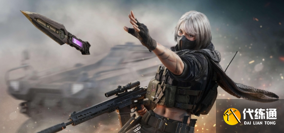
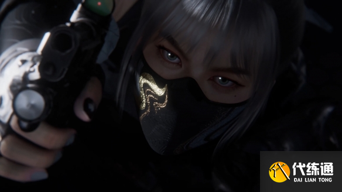
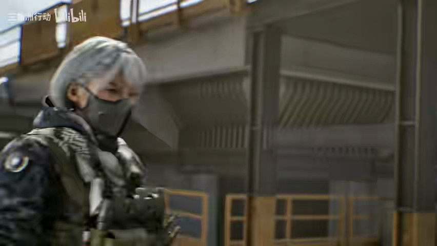
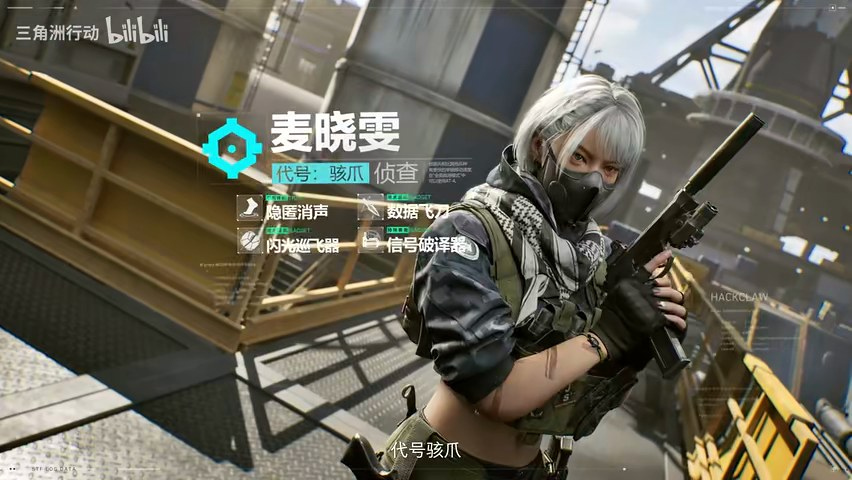
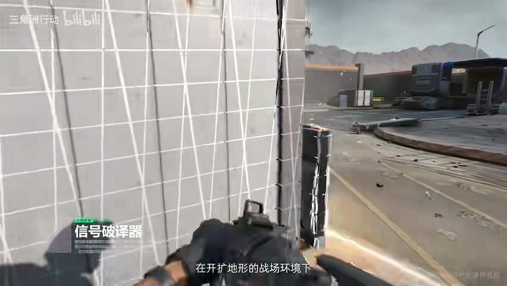
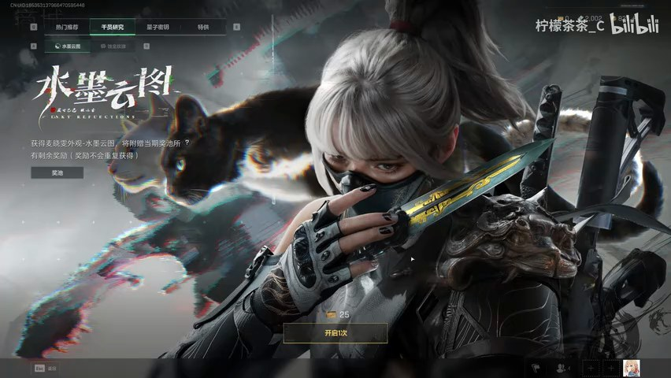
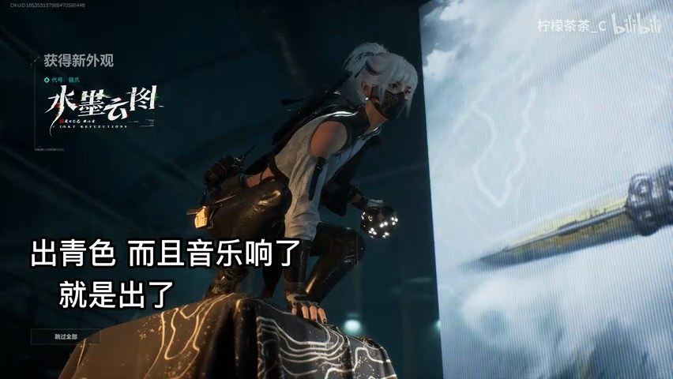
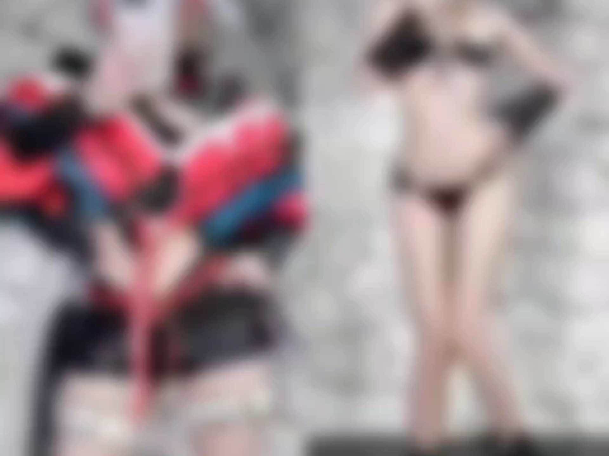

# 麦晓雯（骇爪）Cosplay 企划书

> 生成时间：2026-07-31
> 模板：cosplay-production（角色Cosplay企划工作台）
> 状态：企划草案（待三视图收集确认）

---

## 1. 角色档案（Character Dossier）

```
- 出处：《三角洲行动》（Delta Force，腾讯天美，2025）
- 身份：中国籍侦察干员，天才黑客 / 电子战专家，隶属反哈弗克阵营
- 性格关键词：傲娇、机敏、黑客范儿、死傲娇（表面嘴硬内心温柔）
- 气质定位：飒爽的广东网瘾少女 × 顶级黑客
- 标志性元素：银白短发、黑色口罩、黑白围巾、信号破译器
- 名场面/经典动作：破译器扫描姿势、蹲伏潜行、虚拟键盘敲击、侧身回头
- 别称：麦小鼠（玩家戏称）、广东猫娘
- 背景：2013年11月16日生于广东，顶级黑客，早年以「骇爪」网名揭露反派组织「哈夫克」的黑料与阴谋
- 玩法定位：侦察位 T0 梯队（信号破译器 + 闪光巡飞器）
```

---

## 2. 设定图与三视图收集（Reference Collection）

> ✅ **已收集 38 个文件**（2026-07-31），按皮肤分轨存于 `~/Desktop/麦晓雯_企划/`
>
> | 目录 | 数量 | 内容 |
> |------|------|------|
> | 原皮/ | 27 | 官方立绘11 + 档案视频抽帧（正/侧面准确帧）+ 封面 |
> | 水墨云图/ | 3 | 实机展示抽帧（正面/侧面·已逐帧验证） |
> | 维什戴尔/ | 1 | Cos正片封面 |
> | 通用/ | 2 | 模型素材/三视图素材封面 |
>
> **原皮三视图**：正面 ✅（官方立绘+档案帧07s） / 侧面 ✅（档案帧00s/06s） / 背面 ⚠️（档案视频未含清晰背面）
> **水墨云图**：正面 ✅ / 侧面 ✅（获得新外观帧） / 背面 ⚠️待补
> **道具参考**：信号破译器 ✅（档案帧32s第一人称画面）

### 2.0 关键参考图（嵌入）

**原皮 · 官方全身立绘（正面）：**





**原皮 · 三视图（档案视频抽帧）：**






**原皮 · 信号破译器道具（第一人称画面）：**



**水墨云图皮肤（国风至臻）：**





**Cos正片封面（维什戴尔）：**



### 2.1 收集优先级

1. **官方立绘**：游戏官网干员页 / 百度百科「骇爪」「麦晓雯」词条 / 游侠网美图汇总
2. **三视图**：正面 + 侧面 + 背面（Pixiv 搜「麦晓雯 三视图」「骇爪 設定」）
3. **细节特写**：黑白围巾系法、口罩款式、战术背心结构、破译器外观
4. **优秀Cos正片**：真人还原效果（妆面/布料质感/上身效果）

### 2.2 主要收集平台与搜索词

| 平台 | 搜索词 | 用途 |
|------|--------|------|
| **Pixiv** | 麦晓雯 / 骇爪 / 三视图 / 設定資料 | 画师设定稿、细节拆分 |
| **Bilibili** | 麦晓雯 设定 / 麦晓雯 cos / 骇爪 三视图 | 视频拆解、Coser正片 |
| **小红书** | 麦晓雯 cos / 骇爪 服装 | 真人正片、妆造过程 |
| 游戏官网 / Wiki | 干员页 / 行动档案 | 官方立绘（最权威） |
| 游侠网 | 「三角洲行动骇爪麦晓雯美图汇总」 | 官方美图集合 |
| 淘宝 | 骇爪麦晓雯cos服 | 服装版型对比验证三视图 |

### 2.3 皮肤版本区分（重要！三视图/造型按皮肤分轨）

**麦晓雯有多个皮肤，造型差异巨大——企划前必须先选定皮肤，三视图和造型解构都按选定皮肤分别收集，不能混用。**

| 皮肤 | 特征 | 出片价值 | 三视图状态 |
|------|------|---------|-----------|
| **原皮** | 银白短发 + 黑战术装 + 黑白围巾口罩 | ⭐ 经典、好驾驭、成本低 | ✅ 正面+背面已收，侧面待补 |
| **水墨云图**（至臻，2025-01-24） | 东方水墨元素、中国风配色 | ⭐⭐⭐ 国风质感惊艳 | ⚠️ 待收集 |
| **维什戴尔**（明日方舟联动红皮） | 红色系为主 | ⭐⭐ 人气高 | ⚠️ 待收集 |
| 其他赛季皮/红皮 | 各异 | 按需 | ⚠️ 待收集 |

**建议：首次先出原皮**，水墨云图留作进阶目标（国风×电子反差最出片）。

### 2.4 皮肤分轨收集目录

```
~/Desktop/麦晓雯_企划/
├── 麦晓雯_企划.md
├── 原皮/          ← 原皮三视图+细节（正/侧/背）
├── 水墨云图/      ← 水墨云图皮肤三视图+细节
├── 维什戴尔/      ← 联动红皮三视图+细节
└── 通用/          ← 破译器等通用道具、角色档案图
```

### 2.5 归档规范

- 统一存 `~/Desktop/麦晓雯_企划/`
- 命名：`官方立绘_正面` `三视图_背面` `细节_围巾` `Cos正片_xxx`
- **按皮肤分子目录归档**（原皮/水墨云图/维什戴尔）
- 每张图记录来源（便于回查/授权确认）

---

## 3. 造型解构（Costume Deconstruction）

### 3.1 发型（Hair）

| 项 | 特征 | 还原方案 |
|----|------|---------|
| 发色 | **银白/白色** | 白色短发假发 |
| 长度 | **短发**（飒爽碎发，到耳/颈） | 选「黑客少女」层次款，可修剪 |
| 发式 | 凌乱感碎短发 | 抓发蜡/发胶做纹理 |
| 标志性细节 | 发尾微翘、层次感 | 造型喷雾定型 |

**要点**：白色短发很考验脸型，但圆脸大眼的脸型能撑住「飒」感；假发到手先用顺发梳打理，再剪出层次。

### 3.2 妆容（Makeup）

| 部位 | 方案 |
|------|------|
| 眼型基调 | 圆眼 + **眼尾微挑**（锐利感关键） |
| 眼线 | 黑色眼线液笔，眼尾上挑 5-10°，画出黑客的机敏 |
| 眉形 | **细挑眉**（比日常眉略挑，增加英气） |
| 眼影 | 大地色打底 + 眼头银白高光（电子感） |
| 唇色 | **裸色/浅豆沙**（作战感，不抢眼妆） |
| 妆面风格 | 清透 + 利落，重点在眼妆的「电子感」 |

### 3.3 服装（Costume）——原皮

| 项 | 特征 | 还原方案 |
|----|------|---------|
| 主色系 | **黑色战术装** | 全套黑 |
| 层次结构 | 战术背心/外套 + 内搭 + 长裤 | 战术背心（可淘宝cos服全套） |
| 标志配饰 | **黑白围巾 + 黑色口罩** | 灵魂！围巾系法参考官方图 |
| 手套 | 黑色战术手套 | 半指或全指均可 |
| 鞋 | 战术靴 | 黑色短靴 |

### 3.4 道具（Props）——灵魂道具

| 道具 | 特征 | 方案 | 预算 |
|------|------|------|------|
| **信号破译器** | 周期性扫描电子信号的小型设备 | 淘宝玩具版 / 道具版，或自制（手机+打印外壳） | ¥50-150 |
| **闪光巡飞器** | 自动锁定目标的无人机 | 可简化省略，或用小型无人机模型 | ¥0-100 |
| 战术耳机/背包 | 丰富造型 | 二手/战术装备店 | ¥50-200 |

---

## 4. 还原方案（Reproduction Plan）

### 4.1 采购清单（原皮）

| 项 | 方案 | 预算 |
|----|------|------|
| 白色短发假发 | 淘宝「骇爪麦晓雯 cos 假发」或通用白色短发 | ¥60-120 |
| 原皮cos服全套 | 淘宝「麦晓雯原皮cos服骇爪」（含围巾口罩背心） | ¥200-400 |
| 信号破译器 | 淘宝道具版 / 自制 | ¥50-150 |
| 战术手套+靴 | 服装店/淘宝 | ¥50-150 |
| **合计** | | **¥360-820** |

### 4.2 执行步骤

1. 三视图收集 → 确认服装结构细节
2. 假发 + 服装 + 道具下单
3. 妆面试妆（裸色 + 锐利眼线）
4. 围巾系法练习（参考官方图，黑白围巾是关键辨识点）
5. 试光（冷调 + 蓝紫氛围）
6. 正式拍摄

---

## 5. 拍摄企划（Shoot Plan）

### 5.1 场景（Location）

| 方案 | 场景 | 适合 |
|------|------|------|
| A | 城市夜景 / 天台 / 废弃工厂（黑客氛围） | 原皮 |
| B | 室内棚拍 + 蓝紫氛围光（电子战感） | 原皮 |
| C | 国风水墨背景（配合水墨云图皮肤） | 进阶 |

### 5.2 光线（Lighting）

- **主光**：冷调（5500K+）硬光或柔光，营造战术感
- **氛围光**：蓝紫 RGB（电子战感）——用 RGB 环形灯 🎨
- **参考**：一灯一板方案（环形灯主光 + 反光板补光）

### 5.3 镜头与动作（Camera & Pose）

- 焦段：50-85mm（半身/特写）
- 机位：低机位仰拍（增强气场）或平视（日常感）
- 经典姿势：破译器扫描动作、蹲伏潜行、侧身回头、虚拟键盘敲击
- 表情管理：傲娇「哼」感 + 专注严肃脸（两种反差）

### 5.4 后期（Post）

- 调色：冷色调 + 轻微高对比（战术感）
- 特效：HUD 扫描线 / 数据流光效（后期叠加）
- 可选：电子故障风（glitch）效果

---

## 6. 执行清单（Execution Checklist）

```
□ 角色档案完成 ✅
□ 三视图/官方设定图收集（Pixiv/B站/小红书/官网）
□ 皮肤版本确认（推荐原皮）
□ 白色短发假发下单
□ 原皮cos服（含围巾口罩）下单
□ 破译器道具确认
□ 妆面方案（裸色+锐利眼线）定稿
□ 拍摄场景踩点
□ RGB灯冷调方案确认
□ 试妆 + 试光
□ 正式拍摄
□ 后期 + 出片
```

---

## 7. 参考资源（Reference Assets）

- 百度百科：「骇爪」/「麦晓雯」词条
- 游侠网：《三角洲行动》骇爪麦晓雯美图汇总（dailiantong.com/news/content_367012.html）
- B站 / 抖音：搜「麦晓雯 cos」（合集累计播放 8.7 亿，参考丰富）
- 淘宝：「骇爪麦晓雯cos服」原皮全套（版型验证）
- 知乎：「如何评价《三角洲行动》干员骇爪」（角色理解）

---

## 附：企划点评

- **选角眼光好**：短发+口罩遮挡面积大，对新手出女角友好；傲娇黑客气质与摄影/技术爱好者人设契合
- **黑白战术装**比裙装好驾驭，出片率高
- **进阶目标**：「水墨云图」皮肤——国风水墨 × 电子战的反差视觉，能发挥摄影功力
- **预算友好**：全套 ¥360-820，比女武神/礼服类角色便宜不少
